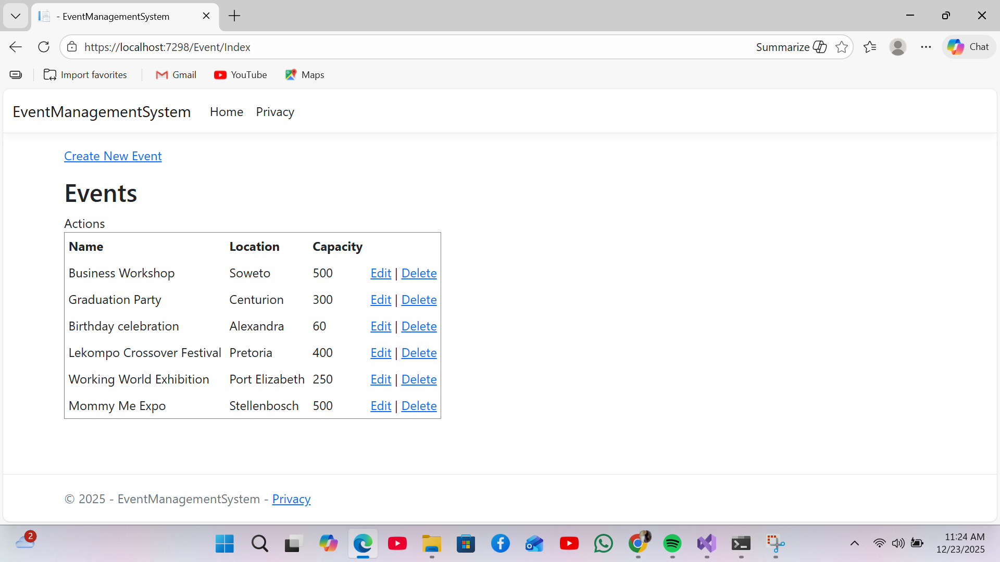
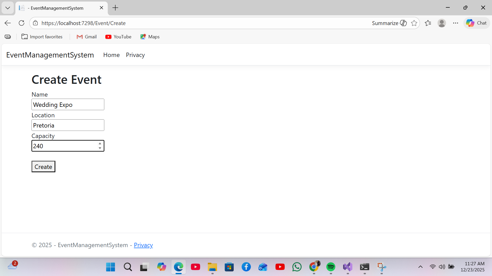
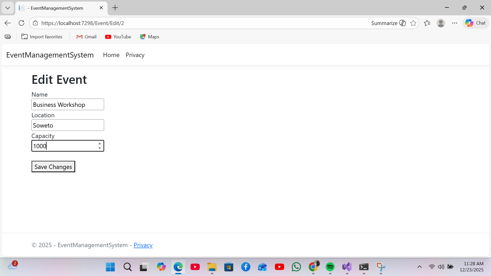

# Event Management System

## Overview
The Event Management System is a web-based application built using **ASP.NET Core MVC**, **C#**, and **SQL** with **Entity Framework Core**. The system is designed to support event planning and management by allowing users to create, view, update, and delete event records through a structured and user-friendly interface.

This project demonstrates practical backend development skills, including MVC architecture, database integration, and CRUD operations using industry-standard tools.

---

## Features
- Create, view, update, and delete events
- SQL database integration using Entity Framework Core
- MVC architecture (Models, Views, Controllers)
- Data persistence with migrations
- Form handling and server-side validation
- Clean and maintainable C# code structure

---

## Technologies Used
- **C#**
- **ASP.NET Core MVC (.NET 8)**
- **Entity Framework Core 8**
- **SQL Server**
- **Razor Views**
- **Git & GitHub**

---

## Project Structure
- **Models** – Defines the Event entity and data structure
- **Controllers** – Handles application logic and database operations
- **Views** – Razor views for displaying and managing events
- **Data** – ApplicationDbContext and EF Core configuration
- **Migrations** – Database schema management

---

## Learning Outcomes
Through this project, I strengthened my understanding of:
- ASP.NET Core MVC application flow
- Entity Framework Core and database migrations
- SQL-backed CRUD operations
- Dependency Injection in ASP.NET Core
- Building structured, maintainable backend systems

---

## Future Improvements
- User authentication and role-based access
- Vendor and attendee management
- Reporting and analytics
- UI enhancements

---
## 📸 Screenshots

### Events List

### Create Event

### Edit Event

## Author
**Emely Mokgadi Machete**  
Bachelor of IT  
Junior Software Developer  

📧 Email: macheteemely@gmail.com  
🔗 LinkedIn: https://www.linkedin.com/in/emelymachete  
💻 GitHub: https://github.com/EmelyMachete
